<div align="center">

# Cooperative Plus

**Réservez votre place de _taxi-brousse_ en 2 minutes — partout à Madagascar.**

Plateforme multi-coopératives : comparez les départs, choisissez votre siège sur le plan réel du véhicule, payez (Mobile Money / espèces / carte) et recevez un billet électronique avec QR code. Côté pro, chaque coopérative gère ses véhicules, itinéraires, départs, réservations et paiements.

</div>

---

## 📱 Application mobile (Expo)

<div align="center">

| Onboarding | Recherche | Choix du siège | Paiement |
|:--:|:--:|:--:|:--:|
|  | 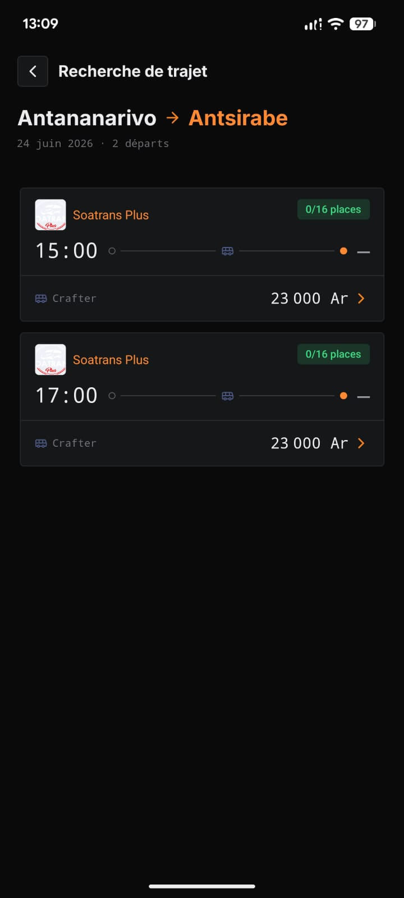 | 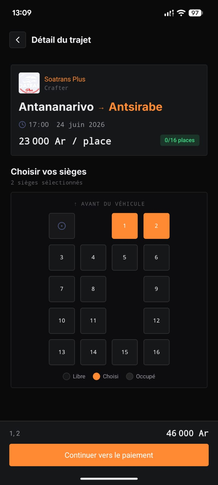 | 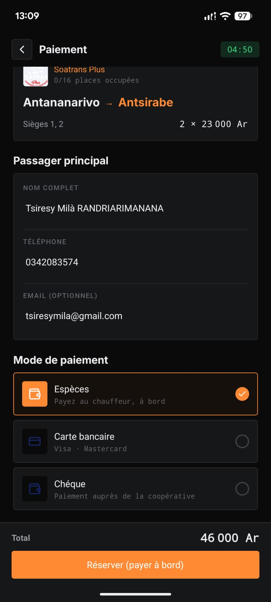 |

| Confirmation + billets | Mes réservations | À propos |
|:--:|:--:|:--:|
| 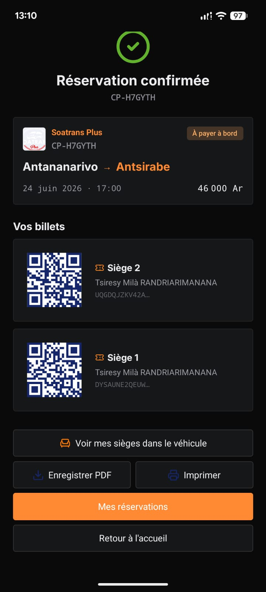 | 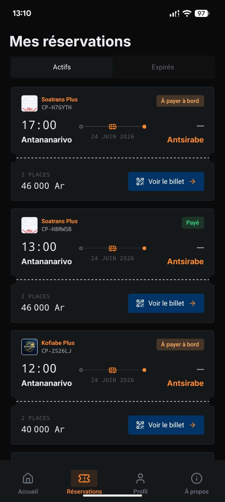 | 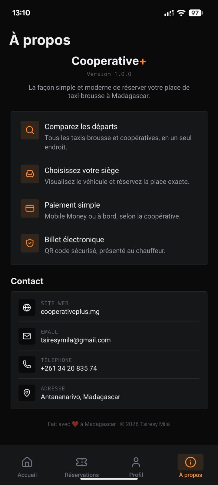 |

</div>

## 🌐 Web client + tableau de bord coopérative

<div align="center">

| Accueil (client) | Réservation (client) |
|:--:|:--:|
|  | 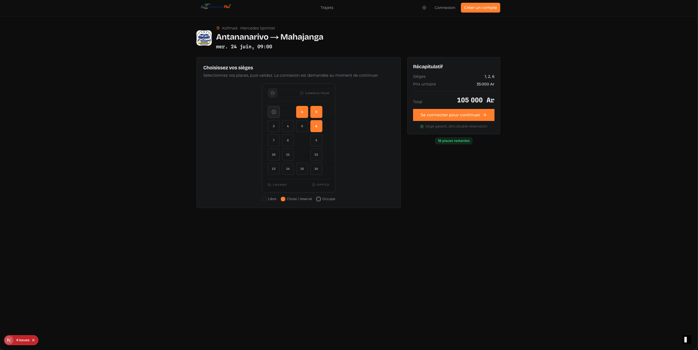 |

| Dashboard coop | Détail trajet + manifeste |
|:--:|:--:|
| 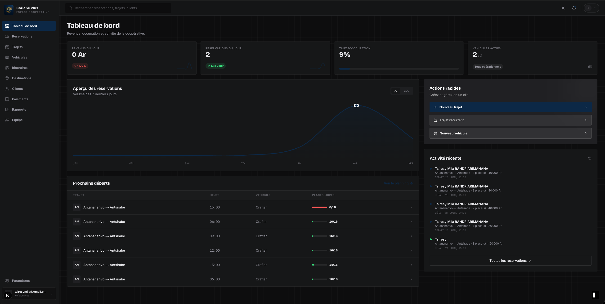 | 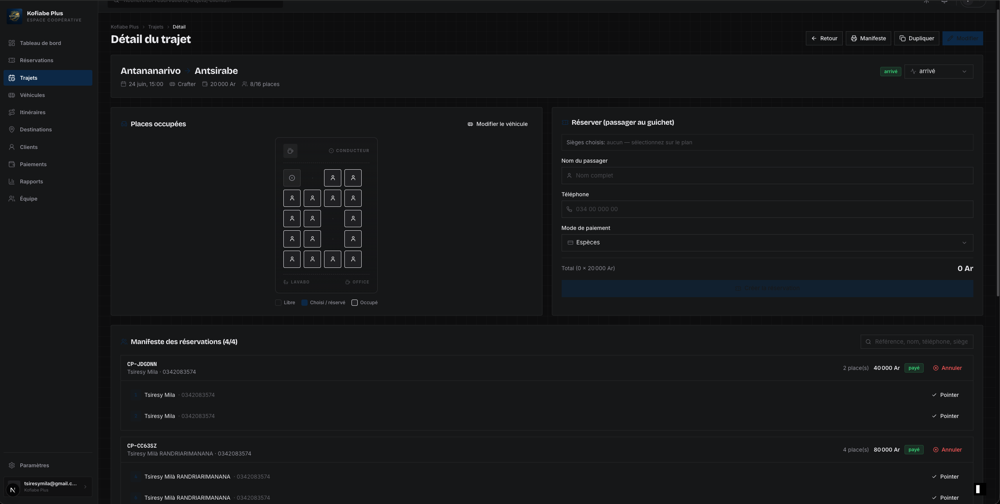 |

| Flotte | Itinéraires | Destinations |
|:--:|:--:|:--:|
| 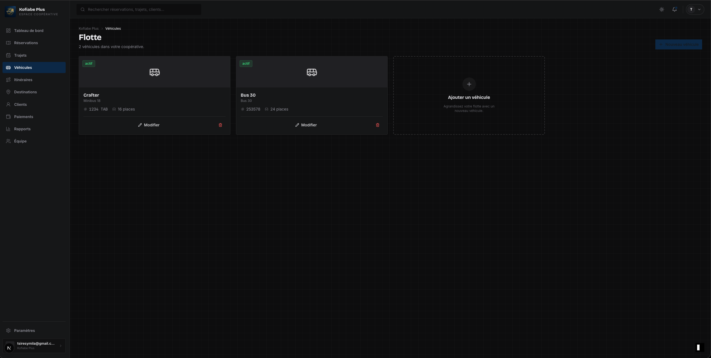 | 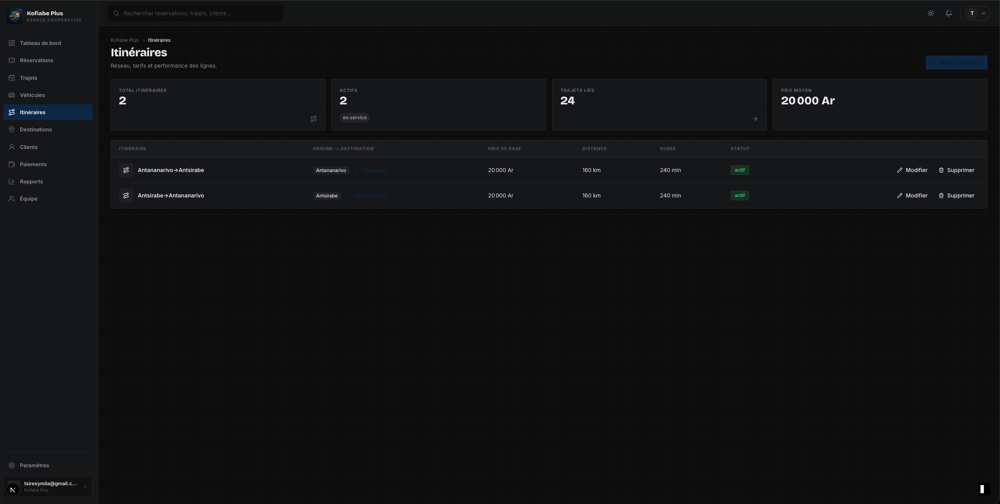 | 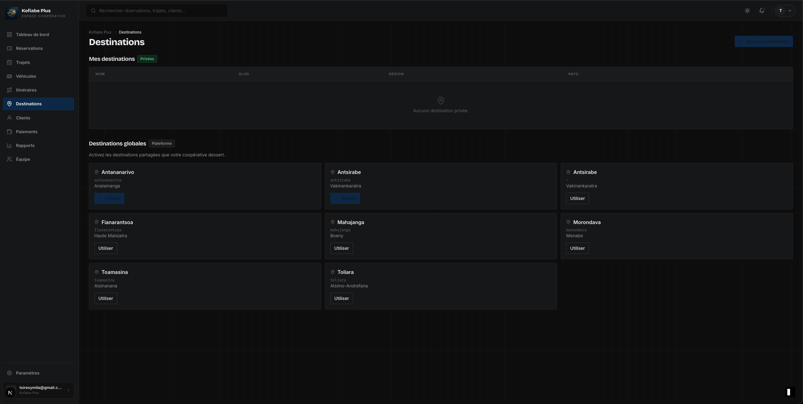 |

</div>

---

## ✨ Fonctionnalités

**Voyageur (mobile + web)**
- Recherche de trajets par départ / arrivée / date — seuls les départs futurs sont affichés.
- Plan du véhicule en temps réel : sièges libres / choisis / occupés, alignés sur la disposition réelle de la coopérative.
- Réservation de plusieurs sièges, siège maintenu **5 minutes** le temps de payer.
- Paiement selon les moyens activés par la coopérative (Mobile Money, carte, espèces à bord).
- Billet électronique **QR code** — voir mes sièges dans le véhicule, enregistrer en PDF, imprimer.
- Mes réservations (actives / expirées), profil, mode **sombre**.

**Coopérative (dashboard web)**
- Tableau de bord (revenus, taux d'occupation, prochains départs).
- Gestion flotte (véhicules + éditeur de plan de sièges), itinéraires, destinations.
- Départs programmés, réservations, manifeste passagers, paiements.

---

## 🧱 Stack

| Domaine | Technologies |
|---|---|
| **Monorepo** | pnpm + Turborepo |
| **Base de données** | InstantDB (realtime, schéma + permissions typés) |
| **Web** | Next.js (App Router) · TypeScript · Tailwind v4 · React Query |
| **Mobile** | Expo SDK 55 · React Native 0.83 (New Arch) · NativeWind v5 (Tailwind v4) · react-native-reusables · Reanimated 4 · gorhom bottom-sheet · expo-router |
| **UI mobile** | Inter (display) · Montserrat (sans) · JetBrains Mono · thème clair/sombre 4px |

## 📂 Organisation

```
apps/
  client/   Next.js — site public : recherche, réservation, billets
  coop/     Next.js — dashboard coopérative
  admin/    Next.js — admin plateforme
  mobile/   Expo — application voyageur (iOS / Android)
packages/
  instant/  schéma + permissions + seed InstantDB
  ui/       composants partagés web
  validation/ schémas Zod
  config/   configs partagées
```

## 🚀 Démarrage

```bash
pnpm install
cp .env.example .env            # EXPO_PUBLIC_INSTANT_APP_ID, etc.

# Base de données (InstantDB)
pnpm db:push-schema
pnpm db:push-perms
pnpm seed

# Web
pnpm client                     # http://localhost:3000
pnpm coop                       # http://localhost:3001
pnpm admin

# Mobile
pnpm mobile                     # Expo (ajouter -- -c pour vider le cache)
```

> Node 20 requis pour les commandes pnpm/Expo.

## 📦 Build & déploiement mobile (Android)

- **Local (sans EAS)** : `npx expo prebuild -p android --clean` puis `./gradlew :app:bundleRelease` (AAB) / `assembleRelease` (APK).
- **EAS local** : `eas build -p android --profile production --local`.
- **CI** : [`.github/workflows/android-build.yml`](.github/workflows/android-build.yml) — build AAB **+** APK signés, artifacts + upload Play (interne) optionnel.
- **Tag de release** : `./scripts/release.sh` (recrée et pousse le tag → déclenche le build).

Config build : [`apps/mobile/eas.json`](apps/mobile/eas.json). Détails : voir la section deploy ci-dessus.

## ⚖️ Mentions légales (requis Play Store)

- Politique de confidentialité — `/privacy`
- Conditions d'utilisation — `/terms`
- Suppression des données / compte — `/data-deletion`

(Pages servies par l'app web `apps/client`.)

## 📐 Docs produit

| # | Document |
|---|---|
| 1 | [PRD](docs/01-PRD.md) |
| 2 | [Schéma base de données](docs/02-DATABASE-SCHEMA.md) |
| 3 | [RBAC](docs/03-RBAC.md) |
| 4 | [API](docs/04-API-SPEC.md) |
| 5 | [User flows](docs/05-USER-FLOWS.md) |
| 6 | [Architecture](docs/06-ARCHITECTURE.md) |
| 7 | [Folder structure](docs/07-FOLDER-STRUCTURE.md) |
| 8 | [Wireframes](docs/08-WIREFRAMES.md) |
| 9 | [Roadmap & monétisation](docs/09-ROADMAP-MONETIZATION.md) |

## 🔒 Sécurité (notes)

- Sûreté des sièges : double-réservation impossible via contrainte `unique` sur `seatKey` (tickets + holds) — pas de logique applicative.
- Les voyageurs n'écrivent jamais `tripInstances` ; la disponibilité dérive du nombre de tickets.
- `EXPO_PUBLIC_*` est public (embarqué dans le bundle) ; la sécurité repose sur les **permissions InstantDB**, pas sur le secret.

<div align="center">

Made with ❤️ · © 2026 Tsiresy Milà

</div>
